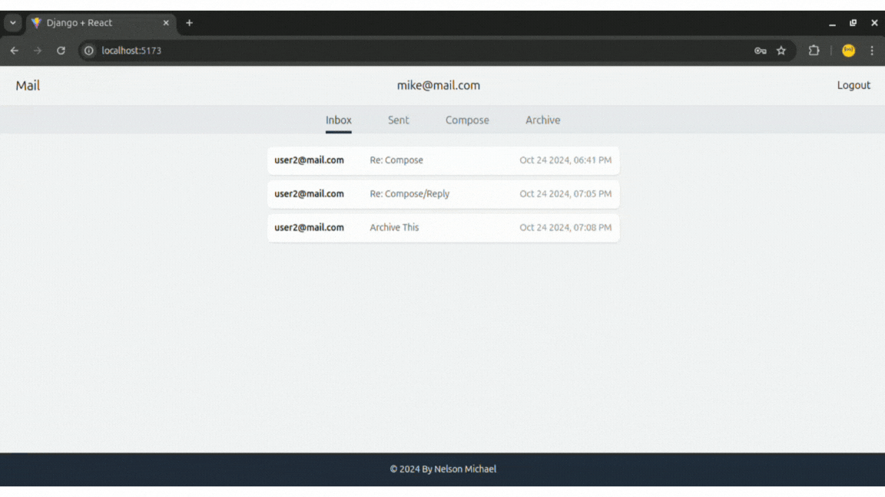

# Mail

## Description

A Single-page email client that makes API calls with React.js

## Specification

1.Login, register and Logout user.

- 

- 

- 

  2.Send Mail: User can Send mail.

- 

  3.Mailbox: When a user visits their Inbox, Sent mailbox, Archive, load the appropriate mailbox

- 

  4.Reply: Users can Reply to an email.

- 

  5.Read/unread: Emails which are unread are markd gray and the mails which are read are marked white.

- 

  6.Archive and Unarchive emails.

- 
